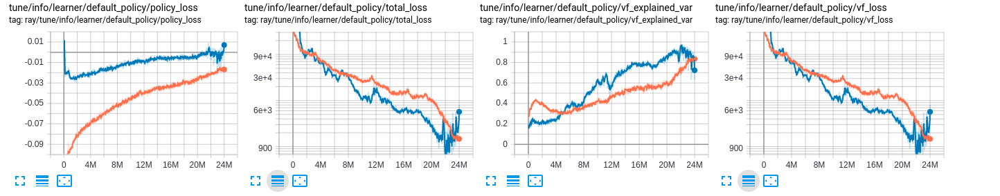
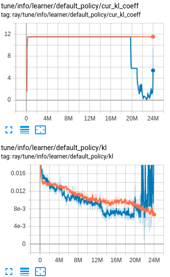
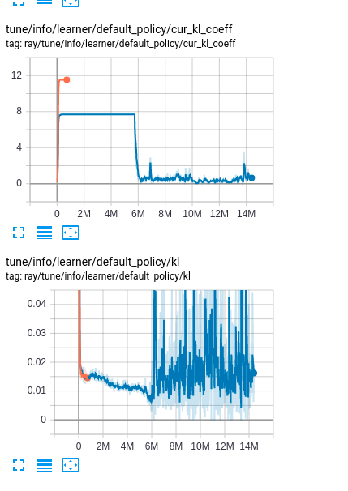

# Experiments Notes

This note is used to document the parameter tuning process for taxi rebalancing project.
It is necessary to keep track of the methods we have tried and parameters we have tuned
for future reference. 

## Current Method
* **SAC**: we started with this method. It is complicated and has no good convergence guarantee.
* **DQN**: and its variants. Classic method simple to tune. We need to reformulate
our action to discrete space for this method.
* **DDPG**: good for continuous control problem.
* **PPO**: state of the art policy gradient method.


## 4/24/2020
* Parameters to tune for __SAC__
    * Learning rates for all three networks.
    * Policy update rate tau
    * NN structure
    * Temperature coefficient alpha
    * Target Q network update frequency
    * Gradient norm clipping
    * experience replay
    * Episode length
    * Batch size
* Start with a fixed temperature coefficient (alpha = 1)
* 5 nodes with 80 cars at start
* Gradient norm clipping at 5
* Total iteration 3000 iter times 5 episodes per iter times 60 steps per episodes
* Default nn config (256, 256) for both
* Today's experiments:
    1. a smaller actor net (128, 128), (128, ), (256, ), (256, 128), (128, 256)
    2. default
    3. with experience replay
    4. double episode length
    
 * **Results**: The results are way worse than before. Need to start from the 
 beginning to figure out which parameter was causing the problem, then proceed
 from there. 
 
## 5/09/2020

* Switched to **PPO** with discrete action. Each node only chooses one nodes to 
send a portion of its own empty vehicles

* **Experiment Setting**
    1. **lr 0.003**, iter 2000, init_veh 16 (orange)
    2. **lr 0.005**, iter 2000, init_veh 16 (blue)
  
* **Results**: Only saved sim results for experiment 2. Problem fixed for future
 code. The dispatch trip is 1883 larger than 749 of the MaxWeight. The highest
 waiting time of 1 min occurred at node 186, which is less than MaxWeight's 1.6 min.
 
* Losses: Smaller learning rate provided marginal difference in convergence speed.
However, smaller lr caused instability as the algorithm got close to convergence.
Both are worse than the reward scaled experiments.



* KL: KL shows instability when lr = 0.005.



## 5/10/2020

* **Experiment Setting**
```shell script
python3 ~/SimMultiTrans/Experiments/discrete_action.py \
    --num_cpu 60 \
    --iter 2000 \
    --init_veh 16 \
    --lr 0.005 \
    --dpr 1 \
    --alpha 0.1 \
    --wkr_smpl_size 120
```

* **Results**: The reward scaling coefficient ```alpha``` really helped with the convergence
compared to those non scaled ones. The policy was able to converge around 6 million steps. The policy
performance is the best among all RL algorithms. The highest waiting time of 4 min
appeared at node 186, which is higher compared to the 1.6 min achieved by MaxWeight.
The rebalancing trips is 1245 out of 6526, which is larger than 749 of MaxWeight.
Judging by both waiting time and travel distance, RL is still inferior to MaxWeight.

* Losses: Policy loss is the negative surrogate loss, which is the objective we
are trying to maximize. With policy loss going to 0, we can tell that the policy improvement
is converging to 0 and the policy is getting stable. Total loss is the policy loss plus 
KL coefficient times action KL plus value function loss coefficient times value function loss
minus entropy coefficient time entropy. Value function loss is the neural network loss.
Entropy is the action distribution entropy. Action KL is the divergence between 
previous action distribution and current one. 


Here is the explained variance code from Ray repo:
```python
from ray.rllib.utils import try_import_tf, try_import_torch

tf = try_import_tf()
torch, nn = try_import_torch()

def explained_variance(y, pred, framework="tf"):
    if framework == "tf":
        _, y_var = tf.nn.moments(y, axes=[0])
        _, diff_var = tf.nn.moments(y - pred, axes=[0])
        return tf.maximum(-1.0, 1 - (diff_var / y_var))
    else:
        y_var = torch.var(y, dim=[0])
        diff_var = torch.var(y - pred, dim=[0])
        min_ = torch.Tensor([-1.0])
        return torch.max(
            min_.to(
                device=torch.device("cuda")
            ) if torch.cuda.is_available() else min_,
            1 - (diff_var / y_var)
        )
```

* KL: The update got unstable at 6 million step possibly due to the fixed learning
rate. The adaptive KL coefficient kicked in to save the day!



* Next step: try annealing learning rate and smaller ``alpha``.

